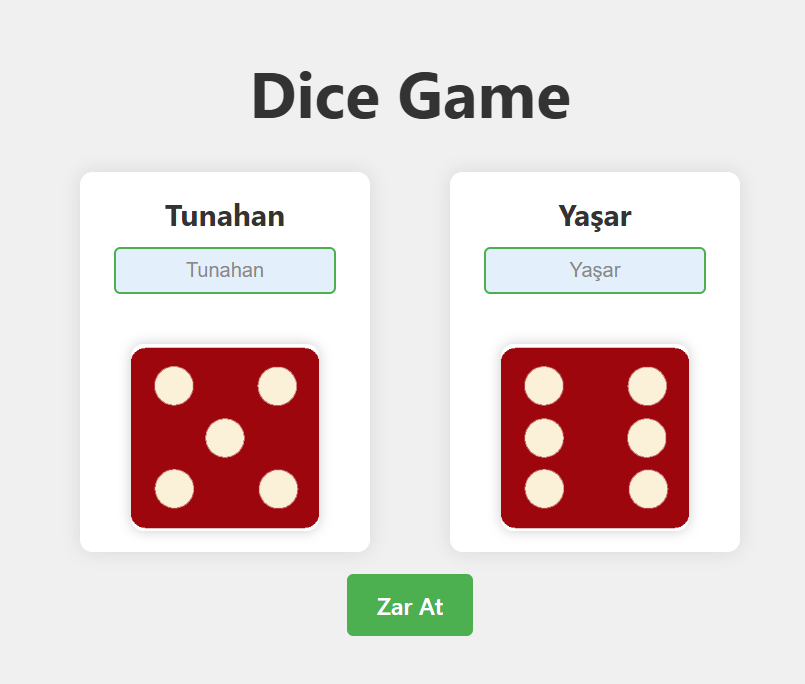
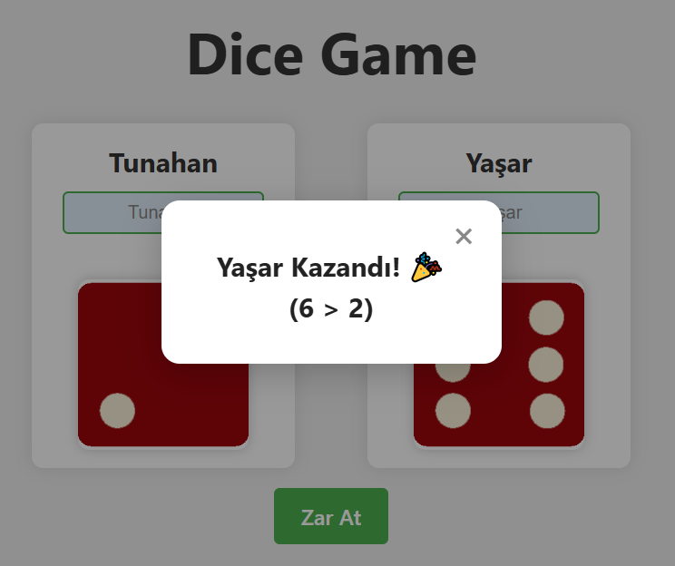
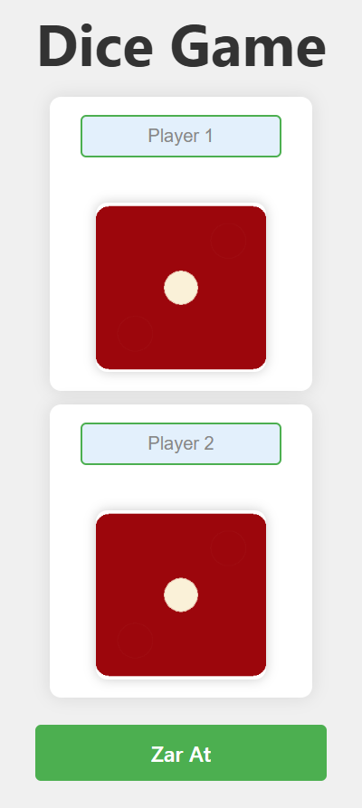

# 🎲 React Dice Game | React + Vite

[🇹🇷 Click for Turkish README](./README.tr.md)

*Created: April 9, 2025*

- This project is a simple and fun two-player dice game developed with React and Vite.
- Created as the **Week-9 / Assignment-2 | React - Dice Game** project for Patika Frontend Bootcamp.
- Modern and fully responsive dice game project.
- Built with **React**, **Vite**, **CSS3**, and **JavaScript**.
- Developed using component structure and props system.
- Fully responsive design.

---

## 🚀 Live Demo

Play the game online: [Dice Game | Reactjs](https://dice-game-reactjs-gilt.vercel.app/)

---

## :computer: Installation & Usage

1. Clone the repository:
```bash
git clone https://github.com/tunahanyasar/dice-game-reactjs.git
```
2. Go to the project folder:
```bash
cd dice-game-reactjs
```
3. Install dependencies:
```bash
npm install
```
4. Start the development server:
```bash
npm run dev
```
5. Open in your browser: [http://localhost:5173](http://localhost:5173)

---

## 🎮 How to Play?

1. Each player can enter their own name.
2. Click the "Roll Dice" button to roll the dice.
3. Dice will spin with animation.
4. The result is displayed on the screen:
   - The player with the higher dice wins.
   - If equal, it's a draw.
5. Click "Roll Dice" again for a new round.

---
## 📜 Project Structure

:open_file_folder: **Folders and Files:**

- **src/**
  - **components/**
    - Dice.jsx
    - Dice.css
    - Player.jsx
    - Player.css
    - GameResult.jsx
    - GameResult.css
  - **assets/**
    - **images/**
      - dice1.png
      - dice2.png
      - dice3.png
      - dice4.png
      - dice5.png
      - dice6.png
  - DiceGame.jsx
  - DiceGame.css
  - App.jsx
  - main.jsx
  - index.css
- **screenshots/**
  - page.png
  - result.png
- **index.html**
- **package.json**

1. **src/components/**: Contains all React components
    - **Dice.jsx**: Single dice component
    - **Player.jsx**: Player info and dice control
    - **GameResult.jsx**: Displays game result

2. **src/assets/images/**: Dice images
    - **dice1.png - dice6.png**: Dice faces

---

## :star2: Features

1. **Game Features**
   - Two-player system
   - Random dice roll
   - Instant result display
   - Change player names
   - Dice roll animation

2. **Modern UI/UX**
   - Clean and modern interface
   - Responsive design
   - Animated transitions
   - Dice roll effects

3. **Interactive Features**
   - Change player names
   - Roll dice button
   - Result display
   - Status notifications

---

## 💡 Technologies & Concepts

**React:**
* Component Architecture
* Props System
* State Management (useState)
* Event Handling
* Conditional Rendering

**CSS:**
* Flexbox Layout
* CSS Animations
* Transform & Transitions
* Responsive Design
* Custom Properties

**JavaScript:**
* ES6+ Features
* Array Methods
* Timers
* Random Number Generation
* Event Handling

---

## :paperclip: Screenshots

### Game Start


### Game Result


### Responsive


---


## 📞 Contact

[Tunahan Yaşar](https://github.com/tunahanyasar)

* GitHub: [@tunahanyasar](https://github.com/tunahanyasar)
* LinkedIn: [Tunahan Yaşar](https://www.linkedin.com/in/tunahan-yasar/) 