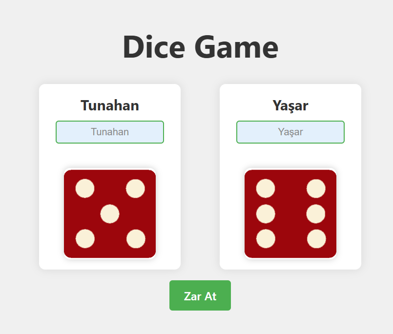

# 🎲 React Zar Oyunu | React + Vite

[🇬🇧 İngilizce README için tıklayın](./README.md)

*Oluşturulma Tarihi : 9 Nisan 2025*

- Bu proje, React ve Vite ile geliştirilmiş iki oyunculu basit ve eğlenceli bir zar atma oyunudur.
- Patika Frontend Bootcamp'i kapsamında **Hafta-9 / React - Dice Game** projesi olarak oluşturulmuştur.
- Modern ve tamamen responsive bir zar oyunu projesidir.
- **React**, **Vite**, **CSS3** ve **JavaScript** ile geliştirilmiştir.
- Component yapısı ve props sistemiyle yazılmıştır.
- Tamamen responsive tasarıma sahiptir.

---

## 🚀 Canlı Demo

Oyunu çevrimiçi oyna: [Dice Game | Reactjs](https://dice-game-reactjs-gilt.vercel.app/)

---

## :computer: Kurulum ve Kullanım

1. Projeyi klonlayın:
```bash
git clone https://github.com/tunahanyasar/dice-game-reactjs.git
```
2. Proje klasörüne gidin:
```bash
cd dice-game-reactjs
```
3. Bağımlılıkları yükleyin:
```bash
npm install
```
4. Geliştirme sunucusunu başlatın:
```bash
npm run dev
```
5. Tarayıcıda açın: [http://localhost:5173](http://localhost:5173)

---

## 📜 Proje Yapısı

:open_file_folder: **Klasörler ve Dosyalar:**

- **src/**
  - **components/**
    - Dice.jsx
    - Dice.css
    - Player.jsx
    - Player.css
    - GameResult.jsx
    - GameResult.css
  - **assets/**
    - **images/**
      - dice1.png
      - dice2.png
      - dice3.png
      - dice4.png
      - dice5.png
      - dice6.png
  - DiceGame.jsx
  - DiceGame.css
  - App.jsx
  - main.jsx
  - index.css
- **screenshots/**
  - page.png
  - result.png
- **index.html**
- **package.json**

1. **src/components/**: Tüm React bileşenleri burada bulunur
    - **Dice.jsx**: Tek bir zar bileşeni
    - **Player.jsx**: Oyuncu bilgileri ve zar kontrolü
    - **GameResult.jsx**: Oyun sonucu gösterimi

2. **src/assets/images/**: Zar görselleri
    - **dice1.png - dice6.png**: Zar yüzleri

---

## :star2: Özellikler

1. **Oyun Özellikleri**
   - İki oyunculu sistem
   - Rastgele zar atma
   - Anlık sonuç gösterimi
   - Oyuncu isimlerini değiştirme
   - Zar atma animasyonu

2. **Modern UI/UX**
   - Temiz ve modern arayüz
   - Responsive tasarım
   - Animasyonlu geçişler
   - Zar atma efektleri

3. **İnteraktif Özellikler**
   - İsim değiştirme
   - Zar atma butonu
   - Sonuç gösterimi
   - Durum bildirimleri

## 💡 Kullanılan Yapılar & Kazanımlar

**React:**
* Component Mimarisi
* Props Sistemi
* State Yönetimi (useState)
* Event Handling
* Koşullu Render

**CSS:**
* Flexbox Layout
* CSS Animasyonları
* Transform & Transitions
* Responsive Tasarım
* Custom Properties

**JavaScript:**
* ES6+ Özellikleri
* Array Metodları
* Zamanlayıcılar
* Rastgele Sayı Üretimi
* Event Handling

---

## :paperclip: Ekran Görüntüleri

### Game Start


### Game Result


### Responsive


---

## 🎮 Nasıl Oynanır?

1. Her oyuncu kendi adını girebilir.
2. "Zar At" butonuna tıklayarak zarlar atılır.
3. Zarlar animasyonlu şekilde döner.
4. Sonuç ekranda gösterilir:
   - Büyük zar atan oyuncu kazanır.
   - Eşitlik durumunda berabere.
5. Yeni tur için tekrar "Zar At" butonuna tıklanır.

---

## 📞 İletişim

[Tunahan Yaşar](https://github.com/tunahanyasar)

* GitHub: [@tunahanyasar](https://github.com/tunahanyasar)
* LinkedIn: [Tunahan Yaşar](https://www.linkedin.com/in/tunahan-yasar/)


